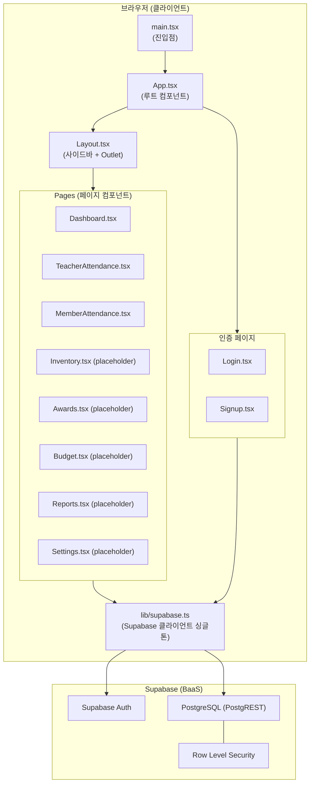
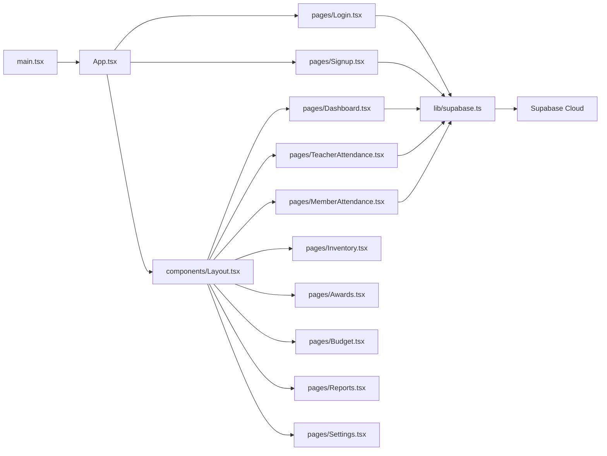
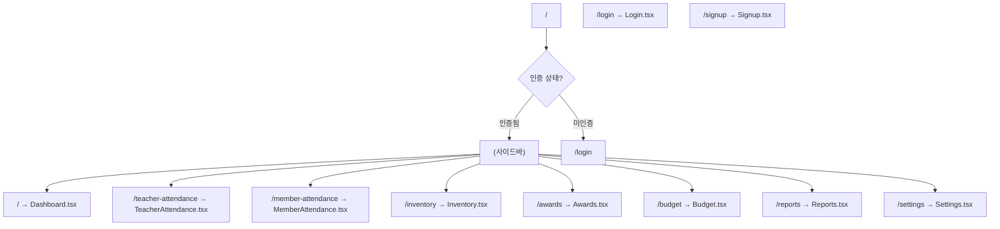
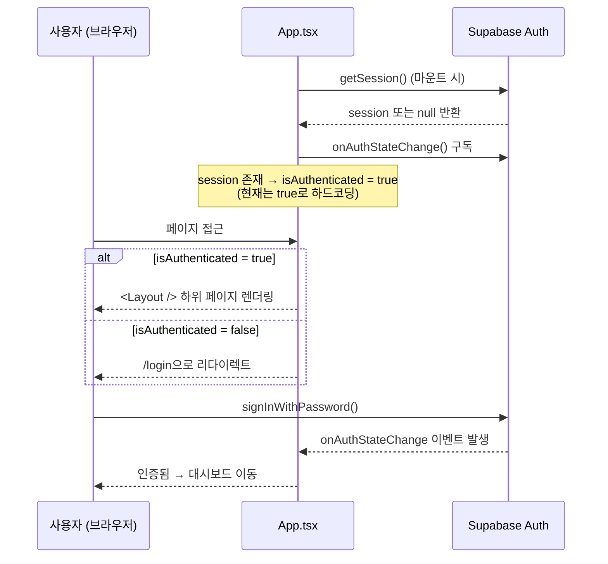
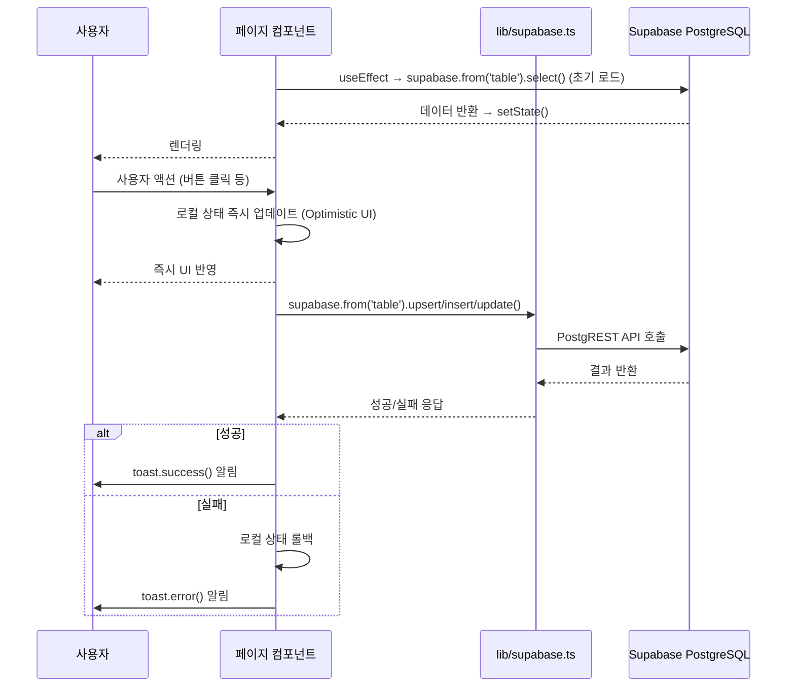
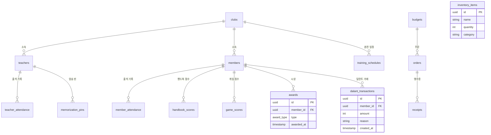
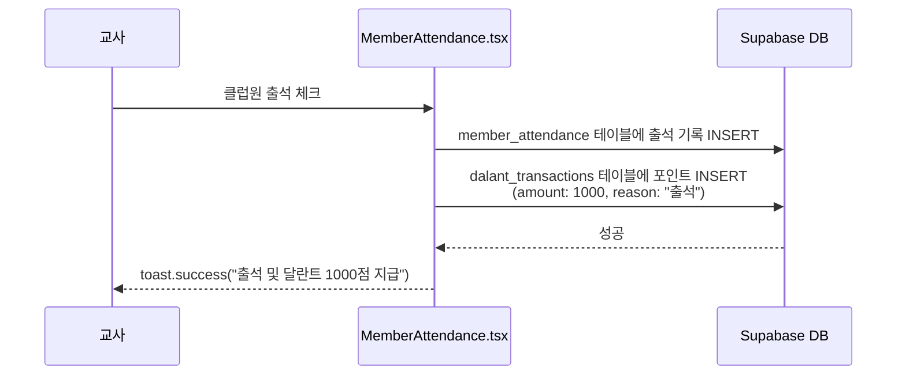

# ARCHITECTURE.md — 어와나 웹 서비스

> **최종 수정**: 2026-03-17
> **버전**: 0.1.0 (초기 개발 단계)

---

## 목차

1. [프로젝트 개요](#1-프로젝트-개요)
2. [기술 스택](#2-기술-스택)
3. [시스템 아키텍처](#3-시스템-아키텍처)
4. [디렉토리 구조](#4-디렉토리-구조)
5. [핵심 의존성](#5-핵심-의존성)
6. [라우팅 구조](#6-라우팅-구조)
7. [인증 흐름](#7-인증-흐름)
8. [데이터 흐름](#8-데이터-흐름)
9. [상태 관리](#9-상태-관리)
10. [데이터베이스 스키마](#10-데이터베이스-스키마)
11. [스타일링 시스템](#11-스타일링-시스템)
12. [주요 디자인 패턴](#12-주요-디자인-패턴)
13. [특수 기능](#13-특수-기능)
14. [개발 현황](#14-개발-현황)
15. [알려진 이슈 및 안티패턴](#15-알려진-이슈-및-안티패턴)
16. [향후 개선 로드맵](#16-향후-개선-로드맵)

---

## 1. 프로젝트 개요

**어와나 클럽 관리 시스템(Awana Club Management System)**은 교회 기반 어와나(Awana) 클럽의 운영을 지원하는 웹 애플리케이션입니다.

### 핵심 도메인

| 도메인 | 설명 |
|--------|------|
| **교사 출석 관리** | 교사 출석 체크 및 이력 조회 |
| **클럽원 출석 관리** | 클럽원 출석 체크 및 달란트 포인트 자동 지급 |
| **시상 관리** | 클럽원 시상 내역 관리 |
| **재고 관리** | 클럽 용품/교재 재고 현황 관리 |
| **예산 관리** | 클럽 예산 및 지출 내역 관리 |
| **보고서** | 출석률, 달란트, 시상 통계 보고서 |
| **설정** | 클럽/교사/클럽원 기본 정보 관리 |

### 지원하는 어와나 클럽 유형

- **스팍스(Sparks)**: 유초등부 대상 클럽
- **티앤티(T&T, Truth & Training)**: 초등 고학년 대상 클럽

### 프로젝트 히스토리

- **Bolt.new** (AI 코드 생성 도구, `bolt-vite-react-ts` 템플릿)로 초기 스캐폴딩
- **Supabase**를 BaaS(Backend as a Service)로 채택, 별도 API 서버 없음
- 현재 초기 개발 단계: 핵심 출석 기능만 구현, 나머지 페이지는 플레이스홀더

---

## 2. 기술 스택

```
┌─────────────────────────────────────────────┐
│           클라이언트 (브라우저)                │
│                                             │
│   React 18.2 (SPA/CSR)                     │
│   TypeScript 5.2 (strict)                  │
│   React Router v6 (클라이언트 라우팅)         │
│   Tailwind CSS 3.4 (스타일링)               │
│   Vite 5.1 (빌드/개발 서버, 포트: 4174)      │
└──────────────────┬──────────────────────────┘
                   │ Supabase JS SDK (HTTP/WebSocket)
┌──────────────────▼──────────────────────────┐
│           Supabase (BaaS)                   │
│                                             │
│   PostgreSQL 15 (데이터베이스)              │
│   Row Level Security (접근 제어)            │
│   Supabase Auth (인증/세션)                 │
│   PostgREST (REST API 자동 생성)            │
└─────────────────────────────────────────────┘
```

### 빌드 및 개발 환경

| 항목 | 내용 |
|------|------|
| **프레임워크** | React 18.2 (SPA, CSR) |
| **언어** | TypeScript 5.2 (strict mode 활성화) |
| **빌드 도구** | Vite 5.1 + @vitejs/plugin-react |
| **패키지 매니저** | npm |
| **초기 스캐폴딩** | Bolt.new (bolt-vite-react-ts 템플릿) |
| **개발 서버 포트** | 4174 |

---

## 3. 시스템 아키텍처

### 전체 아키텍처 다이어그램



### 아키텍처 레이어 설명

| 레이어 | 구성 요소 | 역할 |
|--------|-----------|------|
| **프레젠테이션** | React 18 + React Router v6 | SPA, 클라이언트 사이드 라우팅, 컴포넌트 렌더링 |
| **스타일링** | Tailwind CSS 3.4 | 유틸리티 퍼스트 CSS, 커스텀 테마 미적용 |
| **데이터 접근** | Supabase JS SDK | PostgreSQL 직접 쿼리 (별도 API 서버 없음) |
| **인증** | Supabase Auth | 이메일/비밀번호 기반 인증, 세션 관리 |
| **데이터베이스** | Supabase PostgreSQL + RLS | 15개 테이블, Row Level Security 접근 제어 |

---

## 4. 디렉토리 구조

```
awana-web-service/
├── src/
│   ├── main.tsx                    # 앱 진입점 (ReactDOM.createRoot)
│   ├── App.tsx                     # 루트 컴포넌트 (라우터 설정 + 인증 가드)
│   ├── index.css                   # Tailwind 지시문 및 글로벌 CSS
│   ├── vite-env.d.ts               # Vite 환경변수 타입 선언
│   │
│   ├── components/
│   │   └── Layout.tsx              # 사이드바 내비게이션 + <Outlet /> 레이아웃
│   │
│   ├── lib/
│   │   └── supabase.ts             # Supabase 클라이언트 싱글톤 (createClient)
│   │
│   └── pages/
│       ├── Dashboard.tsx           # 대시보드 (통계 카드 — 구현 완료)
│       ├── Login.tsx               # 로그인 폼 (구현 완료)
│       ├── Signup.tsx              # 회원가입 폼 (구현 완료)
│       ├── TeacherAttendance.tsx   # 교사 출석부 CRUD (구현 완료)
│       ├── MemberAttendance.tsx    # 클럽원 출석부 + 달란트 (구현 완료)
│       ├── Inventory.tsx           # 재고 관리 (플레이스홀더)
│       ├── Awards.tsx              # 시상 관리 (플레이스홀더)
│       ├── Budget.tsx              # 예산 관리 (플레이스홀더)
│       ├── Reports.tsx             # 보고서 (플레이스홀더)
│       └── Settings.tsx            # 설정 (플레이스홀더)
│
├── supabase/
│   └── migrations/                 # SQL 마이그레이션 파일 3개
│       ├── 20240101000000_initial_schema.sql
│       ├── ...
│       └── ...
│
├── .bolt/                          # Bolt.new 설정 (자동 생성)
├── .env                            # Supabase URL + Anon Key (git 제외 필요)
├── .gitignore
├── index.html                      # Vite HTML 진입점
├── package.json
├── tailwind.config.js
├── tsconfig.json                   # TypeScript strict 모드 설정
├── tsconfig.node.json
└── vite.config.ts                  # Vite 설정 (포트 4174)
```

### 의존성 방향 다이어그램



---

## 5. 핵심 의존성

### 프로덕션 의존성

| 패키지 | 버전 | 역할 |
|--------|------|------|
| `react` | 18.2 | UI 프레임워크 |
| `react-dom` | 18.2 | DOM 렌더링 |
| `react-router-dom` | 6.22 | 클라이언트 사이드 라우팅 |
| `@supabase/supabase-js` | 2.39 | 백엔드 서비스 SDK (DB + Auth) |
| `tailwindcss` | 3.4 | 유틸리티 CSS 프레임워크 |
| `lucide-react` | 0.344 | SVG 아이콘 라이브러리 |
| `react-hot-toast` | 2.4 | 토스트 알림 UI |
| `recharts` | 2.12 | 차트 라이브러리 (설치됨, 아직 미사용) |
| `@headlessui/react` | 1.7 | 접근성 높은 UI 컴포넌트 (설치됨, 아직 미사용) |

### 개발 의존성

| 패키지 | 역할 |
|--------|------|
| `vite` + `@vitejs/plugin-react` | 빌드 도구 및 HMR |
| `typescript` | 정적 타입 검사 |
| `@types/react` + `@types/react-dom` | React TypeScript 타입 |
| `autoprefixer` + `postcss` | Tailwind CSS 처리 |

---

## 6. 라우팅 구조

### 라우트 테이블



### 라우트 상세

**인증 필요 라우트 (Layout 하위)**

| 경로 | 컴포넌트 | 구현 상태 |
|------|----------|-----------|
| `/` | `Dashboard.tsx` | 구현 완료 |
| `/teacher-attendance` | `TeacherAttendance.tsx` | 구현 완료 |
| `/member-attendance` | `MemberAttendance.tsx` | 구현 완료 |
| `/inventory` | `Inventory.tsx` | 플레이스홀더 |
| `/awards` | `Awards.tsx` | 플레이스홀더 |
| `/budget` | `Budget.tsx` | 플레이스홀더 |
| `/reports` | `Reports.tsx` | 플레이스홀더 |
| `/settings` | `Settings.tsx` | 플레이스홀더 |

**공개 라우트 (인증 불필요)**

| 경로 | 컴포넌트 | 구현 상태 |
|------|----------|-----------|
| `/login` | `Login.tsx` | 구현 완료 |
| `/signup` | `Signup.tsx` | 구현 완료 |

### 구현 방식

- React Router v6 `BrowserRouter` + 중첩 라우트 패턴 사용
- `Layout.tsx` 내 `<Outlet />`을 통해 페이지 컴포넌트 렌더링
- 인증 가드는 `App.tsx` 내 인라인으로 구현 (별도 컴포넌트 미추출)

---

## 7. 인증 흐름

### 인증 상태 관리 흐름



### 현재 인증 구현의 주의사항

> **중요**: 현재 `App.tsx`에서 `isAuthenticated`가 `true`로 하드코딩되어 있습니다.
> 이는 개발 편의를 위한 임시 조치이며, 실제 배포 전 반드시 수정해야 합니다.

```typescript
// App.tsx — 현재 (개발용 임시 코드)
const isAuthenticated = true; // TODO: 실제 세션 상태로 교체 필요

// App.tsx — 올바른 구현 예시
const [session, setSession] = useState(null);
const isAuthenticated = session !== null;
```

### Supabase Auth 설정

- **인증 방식**: 이메일/비밀번호
- **세션 관리**: Supabase SDK가 localStorage에 자동 저장/복원
- **역할**: `user_role` enum (`admin`, `teacher`) — DB 스키마 정의됨

---

## 8. 데이터 흐름

### 일반 데이터 흐름



### 데이터 접근 방식의 특징

- **서비스 레이어 없음**: 모든 페이지 컴포넌트가 `supabase` 클라이언트를 직접 import하여 사용
- **API 추상화 없음**: 비즈니스 로직과 DB 쿼리가 동일한 컴포넌트 내에 혼재
- **Optimistic UI 패턴**: 출석 체크 등 사용자 액션 시 로컬 상태 먼저 업데이트, 이후 DB 동기화

---

## 9. 상태 관리

### 상태 관리 구조

```
전역 상태 관리 라이브러리: 없음 (Redux, Zustand, Jotai 등 미사용)

App.tsx
└── session (Supabase Auth 세션)
    └── 하위 컴포넌트로 전달되지 않음 (Context 미사용)

각 페이지 컴포넌트 (독립적)
├── 데이터 상태 (useState)
├── 로딩 상태 (useState)
└── 에러 상태 (useState)
```

### 상태 관리 패턴

| 상태 종류 | 관리 위치 | 방법 |
|-----------|-----------|------|
| 인증 세션 | `App.tsx` | `useState` + `supabase.auth.onAuthStateChange()` |
| 페이지 데이터 | 각 페이지 컴포넌트 | `useState` + `useEffect` (Supabase 쿼리) |
| 로딩 상태 | 각 페이지 컴포넌트 | `useState<boolean>` |
| 폼 입력값 | 각 페이지 컴포넌트 | `useState` |
| 토스트 알림 | 전역 (`react-hot-toast`) | `toast()` 함수 직접 호출 |

### 향후 고려할 상태 관리 개선

현재 구조는 단순하여 소규모에서는 동작하지만, 기능 확장 시 다음을 고려해야 합니다:

- **AuthContext**: 세션 정보를 전역으로 공유 (현재 각 페이지에서 별도 접근)
- **커스텀 훅**: 반복되는 데이터 fetch 로직 추출 (`useTeacherAttendance`, `useMemberAttendance` 등)
- **React Query / SWR**: 서버 상태 관리, 캐싱, 자동 재조회

---

## 10. 데이터베이스 스키마

### ERD (Entity Relationship Diagram)



### 테이블 목록

| 테이블명 | 설명 |
|----------|------|
| `clubs` | 어와나 클럽 기본 정보 (스팍스/T&T) |
| `teachers` | 교사 정보 |
| `members` | 클럽원 정보 |
| `training_schedules` | 훈련 일정 |
| `teacher_attendance` | 교사 출석 기록 |
| `member_attendance` | 클럽원 출석 기록 |
| `handbook_scores` | 핸드북 점수 기록 |
| `game_scores` | 게임 점수 기록 |
| `inventory_items` | 재고 아이템 |
| `budgets` | 예산 |
| `orders` | 주문 내역 |
| `receipts` | 영수증/지출 증빙 |
| `awards` | 시상 기록 |
| `dalant_transactions` | 달란트 포인트 거래 내역 |
| `memorization_pins` | 교사 암송 핀 기록 |

### Enum 타입

| Enum | 값 | 설명 |
|------|----|------|
| `user_role` | `admin`, `teacher` | 사용자 역할 |
| `club_type` | `sparks`, `tnt` | 클럽 유형 |
| `order_status` | `pending`, `approved`, `rejected` 등 | 주문 상태 |
| `award_type` | 시상 유형들 | 시상 종류 |

### Row Level Security (RLS) 정책

| 역할 | 접근 권한 |
|------|-----------|
| `admin` | 모든 테이블 읽기/쓰기 가능 |
| `teacher` | 모든 테이블 읽기 전용 |

### 마이그레이션 현황

`supabase/migrations/` 디렉토리에 3개의 SQL 마이그레이션 파일이 존재합니다.

> **알려진 문제**: 3개 마이그레이션 파일이 거의 동일한 스키마를 반복 정의하고 있습니다. 정리가 필요합니다.

---

## 11. 스타일링 시스템

### Tailwind CSS 설정

- **버전**: Tailwind CSS 3.4
- **방식**: 유틸리티 퍼스트(Utility-First)
- **커스텀 테마**: 없음 (기본 Tailwind 테마 그대로 사용)
- **다크 모드**: 미구현

### 주요 컬러 팔레트

| 용도 | 컬러 | Tailwind 클래스 |
|------|------|-----------------|
| 브랜드/메인 | Indigo | `indigo-600`, `indigo-700` |
| 배경 | Gray | `gray-50`, `gray-100` |
| 텍스트 | Gray | `gray-600`, `gray-900` |
| 대시보드 카드 (출석) | Blue | `blue-500` |
| 대시보드 카드 (클럽원) | Green | `green-500` |
| 대시보드 카드 (달란트) | Purple | `purple-500` |
| 대시보드 카드 (예산) | Yellow | `yellow-500` |

### 컴포넌트 스타일링 패턴

- 모든 스타일을 JSX className에 인라인 유틸리티로 직접 작성
- 공통 컴포넌트 라이브러리 없음 (버튼, 카드 등 각 페이지에서 직접 구현)
- `@headlessui/react`가 설치되어 있으나 아직 미사용

---

## 12. 주요 디자인 패턴

### 1. Flat Page-based Architecture (페이지 기반 평면 구조)

모든 비즈니스 로직이 각 페이지 컴포넌트 내부에 직접 포함됩니다.

```
pages/TeacherAttendance.tsx
├── 상태 정의 (useState)
├── 데이터 fetch 로직 (useEffect + supabase.from().select())
├── 이벤트 핸들러 (출석 체크, 저장 등)
├── Supabase 쿼리 (직접 호출)
└── JSX 렌더링
```

### 2. Supabase Direct Access (Supabase 직접 접근)

별도의 API 서버나 서비스 레이어 없이, 프론트엔드에서 Supabase SDK로 PostgreSQL에 직접 접근합니다.

```typescript
// 페이지 컴포넌트 내부에서 직접 호출
const { data, error } = await supabase
  .from('teacher_attendance')
  .select('*, teachers(*)')
  .eq('date', today);
```

### 3. Conditional Route Guard (조건부 라우트 가드)

`App.tsx`에서 `isAuthenticated` 플래그로 라우트 접근을 제어하는 인라인 가드입니다.

```typescript
// App.tsx
{isAuthenticated ? (
  <Route element={<Layout />}>
    <Route path="/" element={<Dashboard />} />
    {/* ... */}
  </Route>
) : (
  <Route path="*" element={<Navigate to="/login" />} />
)}
```

### 4. Sidebar Layout with Outlet (사이드바 레이아웃 + Outlet 패턴)

React Router v6의 `<Outlet />`을 활용하여 사이드바는 고정, 콘텐츠 영역만 교체됩니다.

```
Layout.tsx
├── 사이드바 (내비게이션 링크)
└── <Outlet /> ← 현재 라우트의 페이지 컴포넌트가 여기 렌더링
```

### 5. Optimistic UI with Toast (낙관적 UI + 토스트 알림)

출석 체크 시 DB 응답을 기다리지 않고 로컬 상태를 먼저 업데이트하여 빠른 피드백을 제공합니다.

```typescript
// 즉시 로컬 상태 업데이트
setAttendance(prev => ({ ...prev, [teacherId]: true }));

// 이후 DB 동기화
const { error } = await supabase.from('teacher_attendance').upsert(...);
if (error) {
  // 실패 시 롤백
  setAttendance(prev => ({ ...prev, [teacherId]: false }));
  toast.error('저장 실패');
} else {
  toast.success('출석 처리 완료');
}
```

---

## 13. 특수 기능

### 달란트(Dalant) 포인트 시스템

어와나 클럽의 달란트(포인트) 시스템으로, 클럽원 출석 시 자동으로 포인트가 지급됩니다.



**현재 구현 사항**:
- 출석 1회당 1000 포인트 자동 지급 (하드코딩된 매직 넘버)
- `dalant_transactions` 테이블에 거래 내역 기록
- 포인트 조회/소비 UI는 미구현

### 암송 핀(Memorization Pins) 시스템

교사 대상 암송 핀 기록 시스템입니다.

- `memorization_pins` 테이블에 스키마 정의됨
- UI 미구현 (데이터베이스 레이어만 존재)

### 어와나 클럽 유형 지원

| 클럽 유형 | DB Enum | 대상 |
|-----------|---------|------|
| 스팍스(Sparks) | `sparks` | 유초등부 |
| 티앤티(T&T) | `tnt` | 초등 고학년 |

---

## 14. 개발 현황

### 기능별 구현 상태

| 기능 | 상태 | 비고 |
|------|------|------|
| 로그인/회원가입 | 구현 완료 | 인증 우회 중 (isAuthenticated = true) |
| 대시보드 | 구현 완료 | 통계 카드 표시 |
| 교사 출석부 | 구현 완료 | CRUD 전체 |
| 클럽원 출석부 | 구현 완료 | CRUD + 달란트 자동 지급 |
| 재고 관리 | 플레이스홀더 | UI 미구현 |
| 시상 관리 | 플레이스홀더 | UI 미구현 |
| 예산 관리 | 플레이스홀더 | UI 미구현 |
| 보고서 | 플레이스홀더 | UI 미구현 |
| 설정 | 플레이스홀더 | UI 미구현 |
| 암송 핀 관리 | 미구현 | DB 스키마만 존재 |

### 구현 완료 기능 상세

**교사 출석부 (TeacherAttendance.tsx)**
- 오늘 날짜 기준 교사 목록 조회
- 출석 체크/해제 토글
- Supabase `teacher_attendance` 테이블에 upsert
- Optimistic UI 적용

**클럽원 출석부 (MemberAttendance.tsx)**
- 클럽 유형별(스팍스/T&T) 클럽원 목록 조회
- 출석 체크 시 달란트 1000점 자동 지급
- Supabase `member_attendance` + `dalant_transactions` 테이블 동시 업데이트

---

## 15. 알려진 이슈 및 안티패턴

### 즉시 수정이 필요한 이슈

| 이슈 | 위치 | 설명 | 위험도 |
|------|------|------|--------|
| 인증 우회 하드코딩 | `App.tsx` | `isAuthenticated = true`로 고정 | 높음 |
| `.env` 미보호 | 프로젝트 루트 | Supabase 인증정보가 `.gitignore` 미등록 가능성 | 높음 |
| Supabase 클라이언트 중복 생성 | `TeacherAttendance.tsx`, `MemberAttendance.tsx` | `createClient()`를 직접 호출하여 싱글톤 미사용 | 중간 |

### 코드 품질 이슈

| 이슈 | 설명 |
|------|------|
| 타입 안전성 부재 | Supabase 테이블에 대한 TypeScript 타입 미정의 (`any` 타입 사용) |
| 비즈니스 로직 분리 부재 | 달란트 포인트 계산(1000)이 출석 핸들러에 매직 넘버로 하드코딩 |
| 마이그레이션 중복 | 3개 마이그레이션 파일이 거의 동일한 스키마 반복 정의 |
| 미사용 imports | 플레이스홀더 페이지들에 미사용 import 존재 |

### 아키텍처 부채

```
현재 구조 (문제점):
Page Component
├── UI 로직
├── 비즈니스 로직      ← 분리 필요
├── 데이터 fetch 로직  ← 커스텀 훅으로 추출 필요
└── DB 쿼리           ← 서비스 레이어로 추출 필요

권장 구조:
Page Component → Custom Hook → Service Layer → Supabase Client
```

---

## 16. 향후 개선 로드맵

### 단기 (즉시 적용 권장)

1. **`.env` gitignore 추가**
   ```bash
   echo ".env" >> .gitignore
   ```

2. **인증 우회 코드 제거 (`App.tsx`)**
   ```typescript
   // isAuthenticated = true 제거 후:
   const [session, setSession] = useState(null);
   useEffect(() => {
     supabase.auth.getSession().then(({ data }) => setSession(data.session));
     const { data: { subscription } } = supabase.auth.onAuthStateChange((_, s) => setSession(s));
     return () => subscription.unsubscribe();
   }, []);
   const isAuthenticated = session !== null;
   ```

3. **Supabase 클라이언트 싱글톤 통일**
   ```typescript
   // TeacherAttendance.tsx, MemberAttendance.tsx에서
   // createClient() 직접 호출 제거 → lib/supabase.ts import 사용
   import { supabase } from '../lib/supabase';
   ```

### 중기 (기능 확장 전 적용)

4. **Supabase TypeScript 타입 자동 생성**
   ```bash
   supabase gen types typescript --project-id YOUR_PROJECT_ID > src/types/supabase.ts
   ```

5. **AuthContext 도입**
   ```
   src/contexts/AuthContext.tsx
   └── session, user, signIn, signOut 제공
   ```

6. **커스텀 훅 추출**
   ```
   src/hooks/
   ├── useAuth.ts
   ├── useTeacherAttendance.ts
   └── useMemberAttendance.ts
   ```

7. **서비스 레이어 분리**
   ```
   src/services/
   ├── teacherService.ts     (교사 CRUD)
   ├── memberService.ts      (클럽원 CRUD)
   ├── attendanceService.ts  (출석 처리)
   └── dalantService.ts      (달란트 포인트 관리)
   ```

### 장기 (본격 프로덕션 전)

8. **테스트 환경 구축**
   ```bash
   npm install -D vitest @testing-library/react @testing-library/user-event
   ```

9. **플레이스홀더 페이지 구현**
   - `Inventory.tsx`: 재고 현황, 입출고 기록
   - `Awards.tsx`: 클럽원 시상 관리
   - `Budget.tsx`: 예산 계획 및 지출 관리
   - `Reports.tsx`: `recharts` 활용 통계 차트

10. **에러 바운더리(Error Boundary) 추가**
    - 전역 에러 처리 컴포넌트 도입

---

## 부록: 환경 설정

### 환경 변수 (.env)

```env
VITE_SUPABASE_URL=https://your-project.supabase.co
VITE_SUPABASE_ANON_KEY=your-anon-key
```

### 개발 서버 실행

```bash
npm install
npm run dev       # http://localhost:4174
```

### 빌드

```bash
npm run build     # dist/ 디렉토리 생성
npm run preview   # 빌드 결과물 로컬 미리보기
```

### Supabase 마이그레이션 적용

```bash
supabase db push  # 로컬 마이그레이션을 Supabase 프로젝트에 적용
```

---

*이 문서는 프로젝트 구조가 변경될 때마다 함께 업데이트해야 합니다.*
